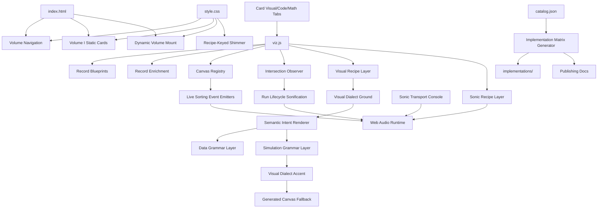

# Architecture

## Runtime Shape

## Components

- `VOLUME_BLUEPRINTS`: curated source arrays for Volumes II-X.
- `enrichSpellRecord`: creates record IDs, signatures, visual modes, proof metadata, and factual descriptions.
- `createSpellCard`: builds card DOM with tags, description, proof rows, canvas, Run/Stop/Reset controls, and Visual/Code/Math technical tabs.
- `semanticVisualIntent`: classifies generated records by title, engine, group, and tags into an explicit diagram intent.
- `recordVisualRecipe`: derives a per-record visual code, lens, marker, line style, motion behavior, data grammar, simulation grammar, projection, interactor, visual dialect, scene graph, chart series, spatial scene, palette, density, tension, and tempo from the record signature and semantic intent.
- `recordAudioRecipe`: derives a per-record sonic code, fingerprint, semantic kernel, waveform, root frequency, shimmer frequency, tempo, ratio set, and eight-state vector from the same record metadata and visual recipe.
- `sonicRuntime`: browser Web Audio synthesizer. It respects the browser user-gesture unlock policy, then plays hover/click/select gestures from card metadata, bounded continuous Run-score streams from active visualizer lifecycles, throttled live algorithm-state events from hand-built sorting demos, and a bounded Monster chorus across 1000 sonic recipes.
- Continuous Run score: explicit Run/record-picker starts create a per-card phrase scheduler. It uses record tempo/vector/ratios/kernel/fingerprint plus live requestAnimationFrame cadence, fades out through `stop(id)`, and self-stops after a bounded duration unless stopped sooner.
- Sonic transport: `runRecord`, `stopRecord`, `resetRecord`, `startAutoSequence`, `stopAutoSequence`, `monsterButton`, and `setSonicMode` expose the same controls used by the UI. Solo mode isolates the latest run voice; overlap mode permits concurrent visible-card run voices.
- Card technical tabs: every card renders Visual, Code, and Math panels from the card's live data attributes. The Code panel documents the real runtime API and evidence fields; the Math panel documents the scheduler equations and algorithm-family model.
- `emitAlgorithmSound`: safe bridge from canvas visualizer loops into `window.__grimoireRuntime.algorithmEvent(id, event)`. If audio is locked or unavailable, the visualizer keeps running.
- `applyCardAudioMetadata`: writes audio recipe fields to card data attributes and CSS variables for audio audits and recipe-keyed shimmer.
- `drawVisualDialectLayer`: renders a record-specific plate in two passes. The ground pass sets the visual world before semantic drawing; the accent pass adds dialect marks and compact scene/series/spatial glyphs after data and simulation layers.
- `drawRecipeScaffold`: adds record-specific technical scaffolding before the semantic renderer: axes, polar phase, temporal lanes, isometric depth, hex bins, simplex/polytope views, contour sections, raster memory, orbit clocks, braid worldlines, quiver fields, treemaps, persistence bars, wavelets, compound graph cells, constraint webs, spiral microscopes, and butterfly transforms.
- `drawSemanticGlyph`: first-pass renderer for generated records; covers graph, logic, probability, sketch/compression, automata, parsing, topology, dynamics, evolution, distributed, crypto, quantum/light, numerical, and undecidable diagram paths.
- `drawDataGrammarLayer`: maps record-derived fields into Vega-Lite-inspired marks and channels such as ticks, ridges, parallel coordinates, heatmaps, radial bins, contours, ledgers, ribbons, facets, stems, swarms, and trellises.
- `drawSimulationGrammarLayer`: maps record-derived state into Rapier-inspired simulation structures such as rigid bodies, spring joints, sensors, broadphase sweeps, collision islands, orbitals, constraints, cloths, arms, particles, contacts, ropes, and simplexes.
- `buildStaticProofRows`: gives the original 30 hand-authored Volume I cards the same semantic visual proof ledger as the generated records while preserving their bespoke canvases.
- `catalog.json`: browser-exported 1000-record source of truth for publication scaffolds outside the runtime.
- `tools/build-implementation-matrix.mjs`: derives the 50-language implementation scaffold, coverage summary, special 1000-algorithm list, GitHub publishing notes, and license/notice files from `catalog.json`.
- `implementations/`: planned source-code expansion tree for 50 language/script targets. It currently has 9 verified Boyer-Moore cells and keeps all other planned cells unverified until real code is added and audited.
- `drawAuthenticGlyph`: generated-record render entrypoint; calls the semantic renderer before the older generated canvas fallback.
- `visualPointer`: global pointer state used for subtle responsive diagram inspection without changing factual rows.
- `IntersectionObserver`: starts only canvases near the viewport to reduce browser freeze risk.
- sticky `.volume-switcher`: keeps all 10 sections clickable while scrolling; it becomes a left rail on laptop/tablet landscape viewports and remains stacked above content on phone portrait viewports.
- `getRecordJumpOffset`: keeps picker jumps below the sticky header in side-rail mode and below the stacked navigation in phone/compact mode.

## Static Site Boundary

The runtime is a plain static GitHub Pages target. `index.html` uses relative local assets only: `style.css` and `viz.js`. There is no package install, bundler, CDN font, analytics script, API token, or remote runtime dependency in the shipped page. The Pages artifact also includes root docs, license/notice/contribution/security/citation files, `docs/`, `implementations/`, and `bibliography/`.

## Performance Notes

Only visible or near-visible canvases animate. Switching volume stops active animations and clears the visible set. This keeps the page from running all 1000 animations at once.

## Verification Surface

- `output/playwright/polymath-1000-audit-runner.js` renders every record through the live page, reads canvas pixel buffers, and checks duplicate hashes, duplicate visual recipes, duplicate proof rows, missing recipe rows, old-template rows, low-detail cards, and runtime errors.
- `output/playwright/polymath-screenshot-runner.js` captures representative card elements in desktop and mobile viewports with sticky chrome hidden only inside the screenshot harness.
- `output/playwright/network-static-audit-runner.js` checks browser resource entries and markup URLs for external runtime requests or root-relative paths that would surprise GitHub Pages.
- `output/playwright/audio-integrity-audit-runner.js` checks all 1000 cards for unique audio codes, audio fingerprints, Sonic proof rows, and fingerprint tuples.
- `output/playwright/audio-interaction-smoke-runner.js` verifies browser audio unlock, SFX class activation, and shimmer class cleanup after a real Playwright click.
- `output/playwright/audio-continuous-run-smoke-runner.js` verifies explicit Run starts continuous phrase scheduling for a hand-authored card and a generated Volume X card, then verifies stop cleanup.
- `output/playwright/audio-control-modes-smoke-runner.js` verifies Solo/Overlap, card Stop/Reset, bounded self-stop, Auto toggle, and Monster 1000-recipe scheduling.
- `output/playwright/code-math-tabs-audit-runner.js` verifies all 1000 cards have Run/Stop/Reset plus Visual/Code/Math panels with runtime evidence and math equations.
- `output/playwright/audio-live-sorting-smoke-runner.js` verifies the live sorting SFX API exists, unlocks Web Audio through a real click, and checks event activation for Sleep Sort, Bogo Sort, Stooge Sort, Quantum Bogosort, Cycle Sort, Cocktail Shaker Sort, and Timsort.
- `output/playwright/browser-console-audit-runner.js` reloads the HTTP-served page, cycles volumes, touches sonic controls, and fails on actionable console warnings/errors or page errors.
- `output/playwright/implementation-matrix-audit-runner.js` checks `catalog.json`, `implementations/languages.json`, `implementations/coverage-summary.json`, all 50 language README files, `docs/ALGORITHMS-1000.md`, license/notice files, and the 50,000 planned / ledger-matched verified implementation-cell honesty boundary.
