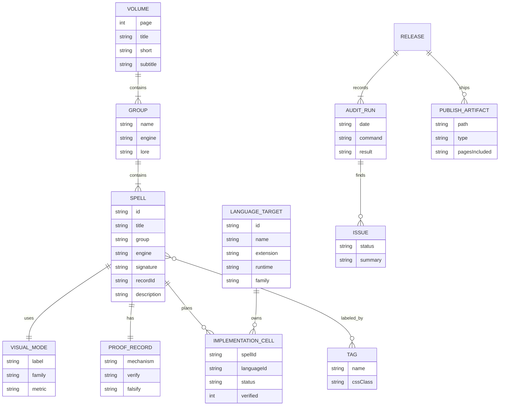

# ERD

```mermaid
erDiagram
  VOLUME ||--|{ GROUP : contains
  GROUP ||--|{ SPELL : contains
  SPELL ||--|| VISUAL_MODE : uses
  SPELL ||--|| PROOF_RECORD : has
  SPELL ||--o{ IMPLEMENTATION_CELL : plans
  LANGUAGE_TARGET ||--o{ IMPLEMENTATION_CELL : owns
  SPELL }o--o{ TAG : labeled_by
  RELEASE ||--|{ AUDIT_RUN : records
  AUDIT_RUN ||--o{ ISSUE : finds
  RELEASE ||--o{ PUBLISH_ARTIFACT : ships

  VOLUME {
    int page
    string title
    string short
    string subtitle
  }
  GROUP {
    string name
    string engine
    string lore
  }
  SPELL {
    string id
    string title
    string group
    string engine
    string signature
    string recordId
    string description
  }
  VISUAL_MODE {
    string label
    string family
    string metric
  }
  PROOF_RECORD {
    string mechanism
    string verify
    string falsify
  }
  LANGUAGE_TARGET {
    string id
    string name
    string extension
    string runtime
    string family
  }
  IMPLEMENTATION_CELL {
    string spellId
    string languageId
    string status
    int verified
  }
  TAG {
    string name
    string cssClass
  }
  AUDIT_RUN {
    string date
    string command
    string result
  }
  ISSUE {
    string status
    string summary
  }
  PUBLISH_ARTIFACT {
    string path
    string type
    string pagesIncluded
  }
```
